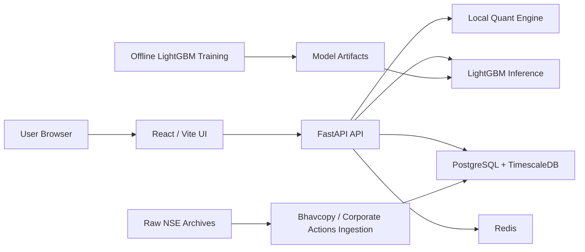

# NSE AI Portfolio Manager Architecture

## Objective

Document the current local-first architecture after removing reliance on any external quant API. The active system is:

- React/Vite UI
- local FastAPI backend
- PostgreSQL + TimescaleDB market store
- NSE bhavcopy ingestion
- local LightGBM hybrid alpha model
- local benchmark, analysis, and backtest services
- readiness/status surfaces for model and market-data health

## Runtime Architecture

## Core Principles

- The UI is presentation and orchestration only; portfolio math lives in Python.
- Portfolio generation, analysis, backtests, and benchmarks all use the same local market store.
- ML training is offline and local. Runtime uses inference only.
- The active expected-return engine is `LIGHTGBM_HYBRID` when a valid artifact exists, otherwise `RULES`.
- The UI derives readiness and valid backtest ranges from backend summary endpoints instead of hardcoded assumptions.
- Raw files are preserved before transformation.
- Historical replay uses dated rules instead of one timeless fee/tax assumption.

## Main Components

### Frontend

Responsibilities:

- submit generation, analysis, backtest, and benchmark requests
- call the model-status endpoint to decide whether the UI should default to `RULES` or `LIGHTGBM_HYBRID`
- call the market-data summary endpoint to constrain valid backtest windows
- surface model runtime info such as variant, source, version, and horizon
- surface training mode and bootstrap-vs-standard artifact classification
- show backend notes and top model drivers
- show benchmark construction notes and proxy labels
- display endpoint failures directly instead of silently switching to a different simulation path

Current endpoint mapping:

- `App` readiness panel -> `GET /api/v1/models/current`, `GET /api/v1/market-data/summary`
- `GenerateTab` -> `GET /api/v1/models/current`, `POST /api/v1/portfolio/generate`
- `AnalyzeTab` -> `POST /api/v1/analysis/portfolio`
- `BacktestTab` -> `GET /api/v1/models/current`, `GET /api/v1/market-data/summary`, `POST /api/v1/backtests/run`
- `CompareTab` -> `GET /api/v1/benchmarks/summary`

### FastAPI Backend

Responsibilities:

- `POST /api/v1/portfolio/generate`
- `POST /api/v1/analysis/portfolio`
- `POST /api/v1/backtests/run`
- `GET /api/v1/benchmarks/summary`
- `GET /api/v1/models/current`
- `GET /api/v1/market-data/summary`
- market-data ingestion endpoints

### Local Quant Engine

Responsibilities:

- load adjusted histories from the database
- compute factor scores
- estimate expected returns
- estimate shrinkage covariance
- optimize long-only constrained portfolios
- analyze holdings and produce rebalance actions
- run historical replay with dated taxes and fees

Primary implementation:

- `apps/api/app/services/db_quant_engine.py`

### LightGBM Alpha Layer

Responsibilities:

- build supervised monthly decision datasets
- train a local LightGBM regressor
- load validated artifacts at API startup
- score equity snapshots at runtime
- expose model metadata to the UI
- expose validation summaries and evaluation-report metadata

Primary implementation:

- `apps/api/app/ml/lightgbm_alpha/dataset.py`
- `apps/api/app/ml/lightgbm_alpha/train.py`
- `apps/api/app/ml/lightgbm_alpha/predict.py`
- `apps/api/app/ml/lightgbm_alpha/artifact_loader.py`
- `apps/api/scripts/ml/evaluate_lightgbm_model.py`

## Expected Return Architecture

### Rule Engine

Inputs:

- adjusted total-return history
- risk-mode configuration
- momentum, quality proxy, low-volatility, liquidity, sector strength, size, and beta factors
- simple regime overlay

Output:

- bounded annualized expected return per instrument

### LightGBM Hybrid Engine

Inputs:

- monthly decision-date snapshots
- trailing return / volatility / drawdown / moving-average / liquidity / beta / factor features
- sector and market-cap categorical features

Training target:

- next `21` trading-day adjusted return

Runtime behavior:

- equities use LightGBM when a valid score is available
- ETFs stay on the rule model
- final equity expected return is a blend of ML and rules
- UI receives top contributing model drivers per selected symbol
- model status exposes `training_mode`, `artifact_classification`, and a compact validation summary

## Risk Model and Allocation

Current flow:

1. shortlist candidates by risk mode
2. align total-return history
3. estimate expected returns
4. build annualized shrunk covariance
5. optimize under long-only, asset-cap, and sector-cap constraints
6. persist portfolio run and return notes to the UI

Risk modes:

- `ULTRA_LOW`
- `MODERATE`
- `HIGH`

## Holdings Analysis Architecture

Current flow:

1. price user holdings from the local DB
2. compute sector weights, beta proxy, pairwise correlation, and factor exposures
3. build the optimizer target for the chosen risk mode
4. compare current vs target weights
5. return ranked rebalance actions plus ML scores when available

## Backtest Architecture

Current replay loop:

1. generate the starting portfolio using data available at the selected start date
2. load adjusted OHLC bars and dividend cash events
3. initialize positions with dated transaction costs
4. evaluate stop-loss / take-profit with gap-aware fills
5. rebalance on the configured schedule
6. realize tax lots using FIFO
7. compute STCG, LTCG, cess, fee drag, and cost drag
8. persist backtest run and return the equity curve to the UI

## Tax and Fee Layer

Current scope:

- listed delivery-equity research simulation
- dated schedules for taxes and fees
- FY-wise LTCG exemption handling
- liquidity- and volatility-aware slippage

Important engineering note:

- the fee/tax layer is versioned and already uses a true `12-month` listed-equity LTCG eligibility rule
- it still needs continuous maintenance against new exchange circulars and budget changes

## Benchmark Architecture

Current backend benchmark endpoint is local and active, but still proxy-based.

Implemented today:

- `NSE AI Portfolio`
- `Nifty 50 Proxy`
- `Nifty 500 Proxy`
- `Momentum Factor`
- `Quality Factor`
- `AMC Multi Factor`

Known limitation:

- these are locally computed research benchmarks over the ingested universe, not official historical constituent reconstitution jobs yet
- the benchmark endpoint now returns `construction_method`, `is_proxy`, `source_window`, `constituent_method`, and `limitations` per strategy

## Data Architecture

Bronze:

- raw bhavcopy ZIP files
- corporate-action CSV files

Silver:

- normalized instruments
- daily bars
- corporate actions
- ingestion runs

Gold:

- adjusted total-return histories
- factor snapshots
- portfolio runs
- backtest runs
- ML datasets and model artifacts
- model evaluation reports

## Operational Modes

### Rules Only

- artifact missing, invalid, or unavailable
- backend still serves portfolio, analysis, backtest, and benchmark endpoints

### LightGBM Hybrid

- artifact present and loadable
- UI shows active model version, training mode, artifact classification, and horizon
- portfolio generation and backtests expose model drivers and source metadata

## Verification Status

Verified in the current local code path:

- frontend production build succeeds
- model status endpoint reports local artifact availability
- market-data summary endpoint reports the active local data range
- benchmark summary endpoint returns per-strategy provenance metadata
- generate, analyze, backtest, and benchmark UI flows all reach FastAPI endpoints directly
