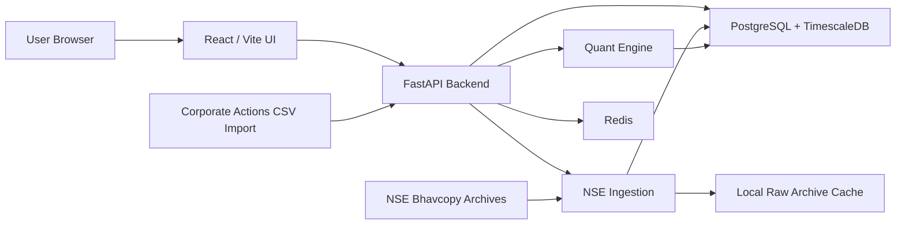

# NSE AI Portfolio Manager Architecture

## Objective

Define the current local-first architecture of the NSE AI Portfolio Manager, with explicit implementation detail for:

- expected return model
- tax model detail
- fee table detail by effective date
- rebalance policy

This document describes the system as it exists now, not just the target future state.

## Runtime Architecture

## Core Principles

- Portfolio construction is deterministic and auditable.
- LLM-style assistance is explanatory only.
- Raw files are preserved before transformation.
- Historical replay uses dated rules rather than one timeless cost/tax assumption.
- The frontend is presentation-oriented; portfolio math lives in Python services.

## Main Components

### Frontend

Responsibilities:

- portfolio generation workflow
- holdings analysis
- backtest controls and result visualization
- benchmark comparison
- backend notes, loading, and fallback handling

Status:

- Complete

### FastAPI Backend

Responsibilities:

- generate portfolio
- analyze holdings
- run backtests
- summarize benchmarks
- trigger market-data ingestion

Status:

- Complete for local development

### Quant Engine

Responsibilities:

- adjusted return construction
- factor scoring
- expected return estimation
- shrinkage covariance
- constrained optimization
- rebalance recommendation generation
- dated fee/tax replay

Status:

- Complete for the current supported local research scope

## Expected Return Model Architecture

### Input Layer

The expected return model consumes:

- adjusted total-return history
- aligned cross-sectional return matrix
- risk-mode configuration
- factor z-scores
- simple market regime classification

### Factor Layer

Current factors:

- `momentum`
- `quality`
- `low_vol`
- `liquidity`
- `sector_strength`
- `size`
- `beta`

Definitions:

- `momentum = 0.20 * 1M + 0.35 * 3M + 0.45 * 6M`
- `quality = annual_return - 0.70 * downside_vol - 0.40 * max_drawdown + beta_discipline`
- `low_vol = -annual_volatility`
- `liquidity = sqrt(avg_traded_value)`
- `sector_strength = stock_momentum - sector_average_momentum`
- `size = {Large: 1, Mid: 0, Small: -1, Unknown: -0.25}`
- `beta = beta_proxy - 1`

### Regime Layer

Current regime logic is rule-based:

- `risk_off`
  - if 3M benchmark return is weak or benchmark volatility is stressed
- `neutral`
  - otherwise
- `risk_on`
  - if 3M benchmark trend is strong and benchmark volatility is contained

Outputs:

- `base_return`
- `risk_on_bonus`

### Risk-Mode Return Blend

#### Ultra-Low Risk

- regime base return
- `0.30 * annual_mean`
- `0.028 * factor_alpha`
- defensive / ETF bonus

#### Moderate Risk

- regime base return
- `0.36 * annual_mean`
- `0.030 * factor_alpha`

#### High Risk

- regime base return
- regime risk-on bonus
- `0.42 * annual_mean`
- `0.035 * factor_alpha`
- cyclical-sector bonus

### Stability Controls

- beta drift penalty around `1.0`
- bounded engineering clamp on expected return before optimization

Status:

- Complete for current scope

Known boundary:

- quality is still a price/risk proxy, not a fundamentals-derived quality factor

## Risk Model and Allocator Architecture

Current flow:

1. shortlist candidates by risk mode
2. align total-return series
3. estimate expected returns
4. compute annualized shrinkage covariance
5. optimize under constraints
6. renormalize and persist allocations

Constraints:

- long-only
- fully invested
- per-asset caps
- per-sector caps
- risk-mode-specific risk aversion

## Rebalance Policy Architecture

Rebalancing is built around optimizer-target drift, not simple equal-sector budgeting.

### Review Cadence

- monthly: `21` trading days
- quarterly: `63` trading days
- annually: `252` trading days
- none: disabled

### Risk-Mode Rules

| Risk Mode | Drift Threshold | Minimum Trade Weight | Cooldown After Exit |
| --- | --- | --- | --- |
| `ULTRA_LOW` | `6.0%` | `3.0%` | `5 days` |
| `MODERATE` | `4.0%` | `2.5%` | `7 days` |
| `HIGH` | `3.0%` | `2.0%` | `10 days` |

### Execution Logic

- compare live holdings against current optimizer target
- rebalance only when:
  - drift exceeds threshold
  - trade size exceeds minimum trade budget
- sell overweights first
- buy underweights only if:
  - cash exists
  - cooldown has expired

Status:

- Complete for current scope

Known boundary:

- no persisted rebalance-plan approval workflow yet

## Simulation and Cost Architecture

### Historical Replay

Current simulator uses:

- stored daily OHLC bars
- gap-aware stop/take-profit evaluation
- benchmark comparison
- drift-threshold rebalancing
- dividend cash credits when corporate actions are loaded

### Live-Market Behavior Approximation

Implemented:

- if the open crosses a stop/target, fill at the open
- otherwise fill at the trigger level
- liquidity-loaded slippage
- volatility-loaded slippage

Status:

- Partial

Known boundary:

- no intraday or order-book execution model

## Tax Model Architecture

### Scope

Supported scope:

- listed delivery-equity research simulation

### Lot Accounting

- FIFO lots per symbol
- realized gains bucketed by:
  - financial year
  - holding period
  - effective tax schedule

### Holding Period Rules

- `STCG`: holding period `< 365 days`
- `LTCG`: holding period `>= 365 days`

### Effective-Date Tax Schedules

| Effective From | STCG | LTCG | LTCG Exemption | Cess |
| --- | --- | --- | --- | --- |
| `2020-07-01` | `15%` | `10%` | `Rs 1,00,000` | `4%` |
| `2024-07-23` | `20%` | `12.5%` | `Rs 1,25,000` | `4%` |

### Computation Flow

1. bucket realized gains by financial year and schedule
2. tax positive STCG only
3. net LTCG positive and negative within fiscal-year schedule buckets
4. apply LTCG exemption once per financial year
5. compute cess on base tax

Output fields:

- `stcg_gain`
- `ltcg_gain`
- `stcg_tax`
- `ltcg_tax`
- `cess_tax`
- `total_tax`

Status:

- Complete for the current supported delivery-equity scope

Known boundary:

- no surcharge modeling
- no derivatives tax model

## Fee Model Architecture

### Per-Trade Formula

- `brokerage = min(turnover * brokerage_rate, max_brokerage_per_order)`
- `stt = turnover * stt_rate(side)`
- `stamp_duty = turnover * stamp_duty_buy_rate` on buy only
- `exchange_txn = turnover * exchange_txn_rate`
- `sebi_fee = turnover * sebi_fee_rate`
- `gst = (brokerage + exchange_txn + sebi_fee) * gst_rate`
- `slippage = turnover * liquidity_adjusted_slippage_rate`
- `total_costs = sum(all components)`

### Effective-Date Fee Schedules

| Effective From | Brokerage | Max Brokerage | STT Buy | STT Sell | Exchange Txn | SEBI | Stamp Duty Buy | GST |
| --- | --- | --- | --- | --- | --- | --- | --- | --- |
| `2020-07-01` | `0.03%` | `Rs 20` | `0.10%` | `0.10%` | `0.00297%` | `0.00010%` | `0.015%` | `18%` |
| `2024-07-23` | `0.03%` | `Rs 20` | `0.10%` | `0.10%` | `0.00297%` | `0.00010%` | `0.015%` | `18%` |

### Slippage Layer

- participation-based
- volatility-loaded
- capped to avoid unrealistic daily-bar execution assumptions

Status:

- Complete for the current supported delivery-equity scope

Known boundary:

- no broker-plan-specific schedules yet

## Market Data Architecture

### Historical Data

Implemented:

- NSE CM bhavcopy download
- raw zip caching
- normalized instrument + daily-bar upsert
- Timescale hypertable on `daily_bars`
- instrument enrichment hooks

Status:

- Complete

### Corporate Actions

Implemented:

- `corporate_actions` table
- CSV import script
- split / bonus adjustments
- dividend cash credits

Status:

- Partial

Known boundary:

- no automated upstream corporate-actions feed yet

### Live Data

Implemented:

- none

Status:

- Not started

## Persistence Layer

Current persisted entities:

- `instruments`
- `daily_bars`
- `corporate_actions`
- `ingestion_runs`
- `generated_portfolio_runs`
- `generated_portfolio_allocations`
- `backtest_runs`

## Phase Map

| Phase | Area | Status | Notes |
| --- | --- | --- | --- |
| 0 | Frontend shell | Complete | browser UX is live |
| 1 | Backend foundation | Complete | FastAPI, Docker, Postgres, Redis |
| 2 | Historical data | Complete | bhavcopy ingestion + Timescale daily bars |
| 3 | Quant allocator | Complete for current scope | factor-aware expected returns + shrinkage covariance + constraints |
| 4 | Analyzer / rebalance | Complete for current scope | target-diff rebalance logic and factor exposures are live |
| 5 | Simulation realism | Partial | daily OHLC replay + tax/fee realism + corp-action support |
| 6 | Benchmark engine | Partial | proxy benchmarks only |
| 7 | Live / product hardening | Not started | live feeds, broker connectivity, auth, compliance |
