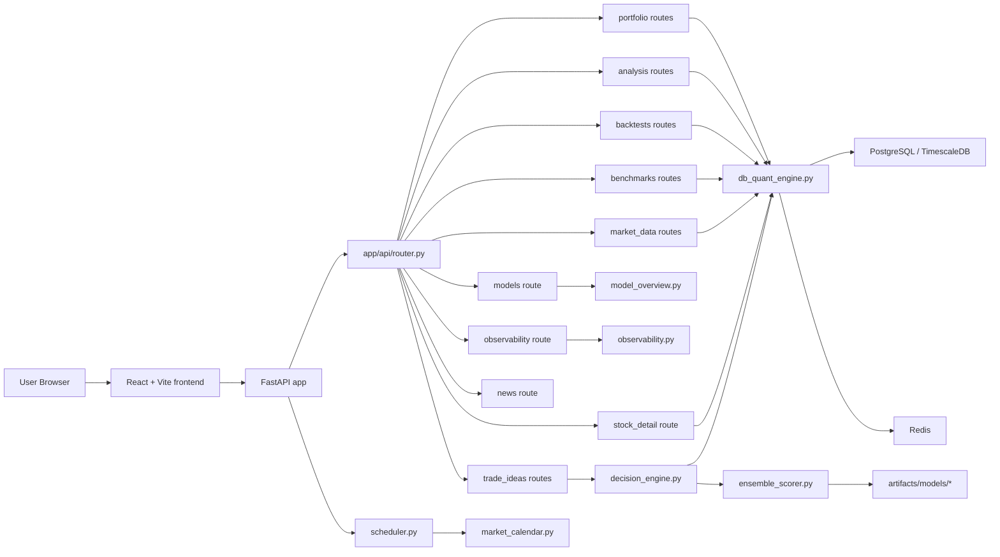

# NSE Atlas Architecture

## Purpose

NSE Atlas is a local-first research system for Indian equity workflows. The current architecture favors:

- backend-authoritative portfolio and backtest logic
- explicit model/runtime and observability surfaces
- typed route contracts from FastAPI through the frontend adapter
- graceful behavior under partial data/artifact availability

## System Topology

## Frontend Surface

`src/App.tsx` currently exposes:

- `Overview`
- `Market`
- `Portfolio`
- `Trade Ideas`
- `Backtest`
- `Compare`

`PortfolioWorkspace.tsx` contains two workflows:

- `Build Portfolio`
- `Analyze Holdings`

No active UI surface currently exists for:

- AI chat
- events tab
- rebalance tab

## API Contract Shape

Notable route families currently mounted:

- `/api/v1/portfolio/*`
- `/api/v1/analysis/*`
- `/api/v1/backtests/*`
- `/api/v1/benchmarks/*` (summary + compare)
- `/api/v1/market-data/*` (summary + regime + ingestions)
- `/api/v1/models/current`
- `/api/v1/observability/kpis`
- `/api/v1/news/market-context`
- `/api/v1/stock/{symbol}`
- `/api/v1/trade-ideas/*` (list + screen + detail)

## Core Runtime Components

- `db_quant_engine.py`: generation, analysis, backtest, market/benchmark assembly
- `decision_engine.py`: trade-idea workflow and scoring checklist
- `ensemble_scorer.py`: component model blending
- `model_overview.py`: model/runtime summary returned by `/models/current`
- `scheduler.py`: timed ingestion trigger with startup/shutdown wiring in `app.main`

The core ensemble path (`price_levels`, `db_quant_engine`, `decision_engine`, `ensemble_scorer`, `artifact_loader`, `gnn graph`) is preserved from `kairavee-improv` in current main.

## Data and Artifacts

Primary stores:

- PostgreSQL/TimescaleDB for instruments, bars, runs, and analysis state
- Redis for runtime support where needed

Model artifact roots:

- `apps/api/artifacts/models/lightgbm_v1/`
- `apps/api/artifacts/models/lstm_v1/`
- `apps/api/artifacts/models/gnn_v1/`
- `apps/api/artifacts/models/death_risk_v1/`
- `apps/api/artifacts/models/ensemble_v1/`

## Operational Notes

- Startup bootstraps local state and lightgbm model status, then starts scheduler.
- Shutdown explicitly stops scheduler.
- Trading-day logic for ingestion is market-calendar aware.
- API/UI integration relies on typed schema mapping in `src/services/backendApi.ts`.

## Validation Envelope

Current fast checks:

- frontend production build (`npm run build`)
- frontend type check (`npm run lint`)
- backend syntax checks (`py_compile`) for modified services/routes

Database-dependent flows (generation, analysis, backtests, many route calls) still require reachable PostgreSQL.
