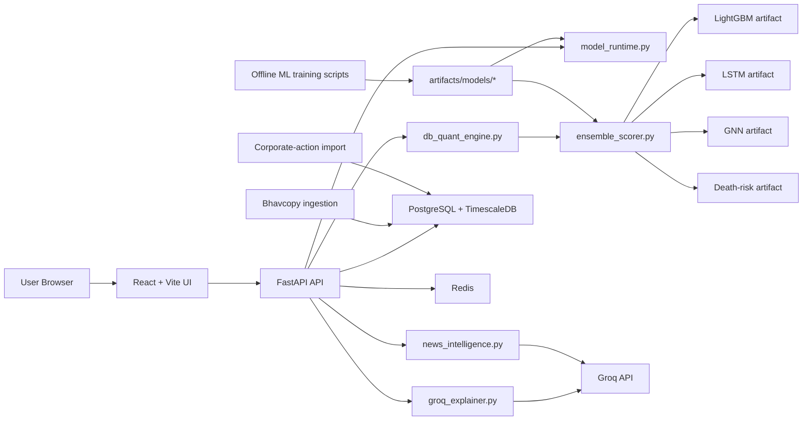

# NSE AI Portfolio Manager Architecture

## Objective

Describe the capstone architecture on the branch rebuilt from `55b69df`.

This branch targets a reliable local demo where:

- the core quant engine is fully local
- ML artifacts are loaded from disk
- Groq is required only for explanation features
- the system exposes its runtime state honestly as `full_ensemble`, `degraded_ensemble`, or `rules_only`

## Topology

## Design Principles

- One backend owns the portfolio, analysis, benchmark, and backtest logic.
- One runtime-status endpoint tells the UI exactly what is available.
- The quant workflow never depends on Groq.
- ETFs remain on rule logic unless a proven ML path exists for them.
- Failure states are visible in the API and UI instead of silently hidden.

## Runtime Contracts

### Model status contract

`GET /api/v1/models/current` returns:

- `variant`
- `model_source`
- `active_mode`
- `model_version`
- `prediction_horizon_days`
- `training_mode`
- `artifact_classification`
- `available_components`
- `missing_components`
- `components`
- `groq_connected`
- `reason`
- `notes`

This endpoint is the source of truth for runtime readiness.

### Ensemble contract

Each model component feeds a symbol-keyed prediction payload into the ensemble scorer.

Common expectations:

- input: `db`, `snapshots`, `as_of_date`
- output per symbol:
  - score
  - model source
  - model version
  - prediction horizon
  - top drivers
  - component scores when available

The ensemble scorer:

- normalizes component weights
- applies death-risk penalty
- emits final expected-return overrides for equities
- exposes whether the runtime was full or degraded

### Groq boundary

Groq sits behind `groq_explainer.py`.

Routes that use it:

- stock explanation
- portfolio explanation
- AI chat

If Groq is unavailable:

- the quant workflow continues
- explanation routes return graceful degradation messages
- the runtime banner reports Groq as unavailable

## Core Backend Components

### `db_quant_engine.py`

This is the main orchestration layer for:

- portfolio generation
- holdings analysis
- backtests
- expected-return estimation
- covariance estimation
- constrained allocation
- rebalance logic
- runtime-aware fallback behavior

### `ensemble_scorer.py`

This service:

- loads and invokes `LightGBM`, `LSTM`, `GNN`, and `death-risk`
- reads `ensemble_v1` manifest metadata
- computes final alpha and model drivers
- returns degraded-mode metadata when some components are missing

### `model_runtime.py`

This service:

- validates local artifact directories
- reports component-level readiness
- inspects Groq connectivity
- computes the current runtime mode
- feeds the frontend runtime banner and preflight decisions

### `stock_detail.py`

This route combines:

- quantitative stock payload
- ensemble score and component scores
- factor and beta metadata
- death-risk and news sentiment
- optional Groq explanation

It is intentionally read-only and must not block generation or backtests.

## Data Architecture

### Stores

PostgreSQL + TimescaleDB holds:

- instruments
- daily bars
- corporate actions
- portfolio runs
- backtest runs
- ingestion runs

Filesystem artifact storage holds:

- `lightgbm_v1`
- `lstm_v1`
- `gnn_v1`
- `death_risk_v1`
- `ensemble_v1`

### Data flow

1. bhavcopy ingestion loads raw EOD data into the market store
2. corporate actions enrich and adjust replay histories
3. training scripts create local model artifacts
4. `model_runtime.py` validates those artifacts
5. `db_quant_engine.py` and `ensemble_scorer.py` use them at runtime

## Frontend Architecture

The existing tabs remain the core capstone surfaces:

- `Generate`
- `Analyze`
- `Backtest`
- `Compare`
- `AIChat`

Frontend responsibilities:

- preflight runtime readiness
- submit backend requests through a single API adapter (`src/services/backendApi.ts`)
- show fallback reasons and component availability
- surface model version, artifact classification, and top drivers
- distinguish quant output from Groq-generated text

### UI communication policy

- operational tab notices are rendered with neutral informational styling
- warning-themed banners are intentionally avoided to keep the UI visually clean
- fallback reasons and failures are still surfaced as plain text status messages for transparency
- runtime tables use monospace typography for improved readability
- invested amounts display conservatively (rounded down) for realistic expectations

### Frontend/API integration contract

- `Generate`, `Analyze`, `Backtest`, and `Compare` are bound to FastAPI routes via the shared API adapter
- AI chat and AI portfolio explanations now use the same adapter and base URL logic as other tabs
- request timeout and lightweight response caching are applied for model-status and market-summary calls to reduce repeated latency on tab transitions

## Local Demo Path

1. start Docker services
2. run migrations
3. ingest bhavcopy data
4. import corporate actions
5. train or materialize artifacts
6. check `/api/v1/models/current`
7. open the UI and confirm the top runtime banner
8. run Generate, Analyze, Backtest, and Compare
9. use stock detail or chat explanations if Groq is configured

## Failure Behavior

### Missing LightGBM

- runtime becomes `rules_only`
- generation, analysis, and backtests still work
- UI must show the fallback clearly

### Missing non-core ensemble components

- runtime becomes `degraded_ensemble`
- available components are used with normalized weights
- UI must list missing components

### Missing Groq

- quant APIs remain healthy
- explanation routes degrade gracefully
- runtime banner shows Groq as unavailable

### Runtime path hygiene

- canonical model artifacts live under `apps/api/artifacts/models/*`
- canonical dataset artifacts live under `apps/api/artifacts/datasets/*`
- stale nested path `apps/api/apps/api/artifacts` was removed to avoid ambiguous lookup behavior

## Current Gaps

- official benchmark constituent reconstruction is not yet implemented
- ensemble quality depends on the presence of trained local artifacts
- live execution is EOD research-grade, not broker-integrated execution-grade
