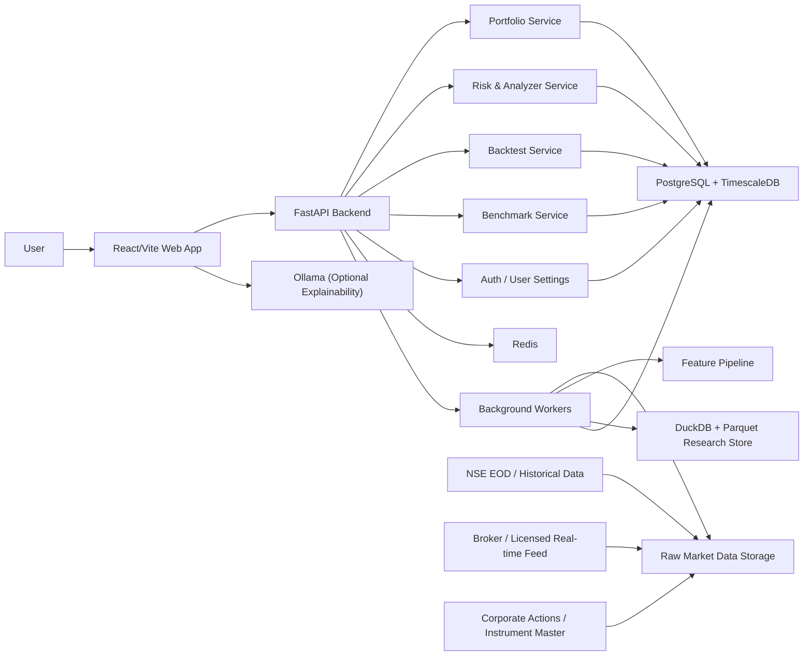

# NSE AI Portfolio Manager Architecture

## Objective

Define the target architecture for evolving the current React/Vite prototype into a production-grade, local-first NSE portfolio platform with:
- AI portfolio generation
- user portfolio analysis and rebalancing
- realistic Indian backtesting
- benchmark comparison
- fully local development without Google AI Studio

## Architecture Principles

- Quant decisions must be deterministic, auditable, and reproducible.
- LLMs are explanation layers, not portfolio decision engines.
- Raw market data must be preserved before transformations.
- Research and production workloads must be separated.
- Historical simulation must use dated fees, taxes, and corporate actions.
- The frontend should remain thin; heavy analytics should live in Python services.

## Current-to-Target Transition

Current repo state:
- React + Vite frontend
- static NSE stock universe
- prototype portfolio generation
- prototype backtest engine
- simulated benchmark comparisons
- local advisory layer for UI explanations

Target state:
- React frontend stays in place
- Python FastAPI backend serves quant APIs
- PostgreSQL + TimescaleDB store user state and market time series
- DuckDB + Parquet support research, training, and feature backfills
- Redis supports cache, queues, and short-lived job state
- Docker Compose supports full local development
- Optional Ollama supports local explainability only

## Logical Architecture



## Recommended Tech Stack

### Frontend

- React 19
- Vite
- TypeScript
- Recharts for analytics visualization
- Future additions:
  - TanStack Query for API state
  - React Router for route-level workspaces
  - Zod for request/response validation

Reason:
- The current UI is already a strong shell and should be preserved.

### Backend

- Python 3.12+
- FastAPI
- Pydantic
- Uvicorn / Gunicorn
- Polars, NumPy, Pandas
- scikit-learn
- PyPortfolioOpt or custom optimizer layer
- statsmodels / hmmlearn for regime detection

Reason:
- Python is a much better fit than TypeScript for portfolio optimization, risk modeling, and market simulation.

### Storage

- PostgreSQL
- TimescaleDB extension
- DuckDB
- Parquet
- MinIO locally, S3 in production

Reason:
- PostgreSQL handles users, holdings, jobs, audit records, and normalized metadata.
- TimescaleDB handles daily/intraday bars, benchmark series, factor histories, and covariances.
- DuckDB + Parquet keep research runs cheap, reproducible, and fast.

### Cache and Jobs

- Redis
- Celery or Dramatiq worker layer

Reason:
- Backtests, factor materialization, rebalancing jobs, and benchmark recomputations are asynchronous workloads.

### Local Explainability

- Optional Ollama container

Scope:
- Explain portfolio rationale
- Summarize analyzer outputs
- Answer user questions over computed metrics

Non-scope:
- Picking stocks
- Optimizing weights
- generating tax calculations

## Service Boundaries

### 1. Web App

Responsibilities:
- portfolio generation wizard
- holdings analyzer UI
- benchmark dashboards
- backtest configuration and result screens
- local explainability/chat shell

Should not do:
- optimizer math
- covariance estimation
- production tax-lot computation
- heavy historical replay

### 2. Portfolio Service

Responsibilities:
- eligible universe selection
- risk-mode constraints
- factor score aggregation
- optimizer execution
- target weights and rebalance plan generation

Core flow:
1. load latest universe snapshot
2. filter by liquidity and risk mode
3. compute factor exposures
4. build covariance matrix
5. optimize with constraints
6. return target weights and rationale

### 3. Risk & Analyzer Service

Responsibilities:
- portfolio beta and volatility
- correlation matrix
- sector concentration
- factor exposure decomposition
- gap-to-target analysis
- buy/sell recommendations against chosen risk mode

### 4. Backtest Service

Responsibilities:
- historical replay using adjusted OHLCV
- stop-loss / take-profit execution logic
- slippage and fee model
- FIFO tax-lot realization
- walk-forward testing
- scenario stress tests

### 5. Benchmark Service

Responsibilities:
- Nifty 50 / Nifty 500 comparison
- equal-weight baseline
- minimum variance baseline
- momentum / quality / multifactor baselines
- AMC-style comparison packs

### 6. Market Data Pipeline

Responsibilities:
- raw ingestion
- normalization
- symbol mapping
- corporate-action adjustment
- feature generation
- benchmark materialization

## Data Pipeline Architecture

## Source Layer

Primary sources:
- NSE historical / EOD data
- licensed or broker real-time quote feed
- corporate actions and instrument master
- benchmark / index constituent references

## Raw Layer

Store every fetched file before processing:
- source
- file date
- checksum
- ingestion timestamp
- processing version

Reason:
- enables replay
- supports debugging
- preserves lineage

## Standardized Layer

Transformations:
- normalize tickers and symbol changes
- standardize timestamp/timezone
- align to NSE trading calendar
- deduplicate records
- enforce instrument identity mapping

## Adjusted Layer

Apply:
- splits
- bonuses
- dividends where needed
- symbol migrations
- delisting handling

Keep:
- raw series
- adjusted series

## Feature Layer

Materialize:
- returns
- rolling volatility
- downside volatility
- beta vs benchmark
- momentum windows
- quality score
- value score
- dividend score
- liquidity score
- covariance snapshots
- regime features

## Serving Layer

Expose to services:
- latest portfolio input features
- historical features for backtests
- benchmark series
- covariance/risk snapshots

## Storage Model

### PostgreSQL / TimescaleDB tables

User and portfolio domain:
- `users`
- `user_preferences`
- `risk_profiles`
- `portfolios`
- `portfolio_holdings`
- `rebalance_plans`
- `orders`
- `fills`
- `tax_lots`
- `backtest_runs`
- `benchmark_runs`

Market domain:
- `instruments`
- `instrument_aliases`
- `daily_bars`
- `intraday_bars`
- `corporate_actions`
- `fundamentals_snapshot`
- `factor_scores`
- `covariance_snapshot`
- `benchmark_series`
- `trading_calendar`

Pipeline domain:
- `ingestion_runs`
- `raw_file_registry`
- `feature_materialization_runs`
- `data_quality_alerts`

### DuckDB + Parquet datasets

Research datasets:
- rolling feature panels
- optimizer experiments
- walk-forward slices
- stress-test scenarios
- model evaluation outputs

## API Architecture

Suggested backend routes:

- `POST /api/v1/portfolio/generate`
- `POST /api/v1/portfolio/analyze`
- `POST /api/v1/portfolio/rebalance`
- `POST /api/v1/backtests/run`
- `GET /api/v1/backtests/{id}`
- `GET /api/v1/benchmarks/summary`
- `GET /api/v1/benchmarks/series`
- `GET /api/v1/market/universe`
- `GET /api/v1/market/instruments/{symbol}`
- `POST /api/v1/explain/portfolio`

Pattern:
- frontend sends config only
- backend computes everything authoritative
- frontend renders and explains results

## AI/ML Decision Stack

The target decision stack should be:

1. Universe filter
   - liquidity thresholds
   - price sanity checks
   - corporate-action exclusions
   - market-cap/risk-mode eligibility

2. Factor scoring
   - momentum
   - quality
   - value
   - dividend/defensiveness
   - liquidity

3. Risk estimation
   - empirical covariance
   - shrinkage covariance
   - beta and volatility
   - concentration penalties

4. Optimization
   - HRP or mean-CVaR
   - sector caps
   - single-name caps
   - turnover constraints
   - hedge floor for lower-risk modes

5. Regime overlay
   - volatility/trend states first
   - HMM / boosted classifier later
   - adjusts exposure ceilings, hedge sleeve, and rebalance cadence

6. Explanation layer
   - deterministic narrative from computed outputs
   - optional Ollama for polished natural-language summaries

## Simulation Architecture

### Historical replay engine

Replace simulated GBM with:
- adjusted daily or intraday historical bars
- benchmark-aligned historical periods
- corporate-action aware holdings valuation

### Execution model

For every rebalance or triggered exit:
- determine reference price
- apply slippage based on liquidity bucket and volatility
- compute brokerage and charges using dated tables
- update holdings, cash, and tax lots

### Tax-lot model

Use FIFO lots:
- every buy creates a lot
- sells consume oldest lots first
- realized gains split into STCG and LTCG
- annual LTCG exemption applied at portfolio/account level

### Output metrics

- CAGR
- volatility
- Sharpe
- Sortino
- Calmar
- max drawdown
- turnover
- benchmark alpha
- information ratio
- tax drag
- cost drag

## Local Development Architecture

Use Docker Compose with:
- `web`
- `api`
- `worker`
- `postgres`
- `redis`
- `minio`
- `ollama` optional

Suggested target repo layout:

```text
apps/
  web/
  api/
workers/
  market_data/
  simulation/
packages/
  quant/
  schemas/
infra/
  docker/
  migrations/
data/
  raw/
  curated/
docs/
```

Practical migration note:
- keep the current frontend in place first
- introduce `apps/api` and `packages/quant`
- move frontend later only if the repo becomes crowded

## Production Deployment Architecture

Recommended region:
- AWS `ap-south-1`

Suggested production layout:
- CloudFront for frontend delivery
- ECS/Fargate for API and workers
- RDS PostgreSQL
- ElastiCache Redis
- S3 for raw files and Parquet
- CloudWatch for logs/metrics
- Secrets Manager for credentials

## Security and Governance

- portfolio decisions must be versioned by model config
- every backtest must record:
  - data version
  - fee table version
  - tax rule version
  - optimizer version
  - benchmark version
- keep audit trails for:
  - holdings uploads
  - rebalance recommendations
  - backtest executions
  - user overrides

## Phase Mapping

### Phase 1: Stabilize frontend
- preserve existing React shell
- keep local advisor
- clean contracts and shared types

### Phase 2: Backend foundation
- add FastAPI
- add PostgreSQL + TimescaleDB
- add Docker Compose
- add typed API contracts

### Phase 3: Real market data
- ingest historical NSE data
- add corporate actions
- add normalized instrument master

### Phase 4: Quant engine
- factor scoring
- covariance model
- optimizer
- regime overlay

### Phase 5: Analyzer and rebalance engine
- user holdings import
- empirical correlation analytics
- rebalance recommendation engine

### Phase 6: Benchmark and research console
- real benchmark histories
- factor baselines
- attribution and scenario testing

### Phase 7: Production hardening
- auth
- auditability
- observability
- compliance/disclaimer workflow

## Immediate Build Path From This Repo

1. Keep the current frontend as the presentation layer.
2. Create a FastAPI backend beside it.
3. Replace static stock data with ingested market snapshots.
4. Replace simulated backtesting with historical replay.
5. Move optimization, benchmarking, and analyzer logic to Python services.
6. Keep local LLM support optional and explanation-only.
