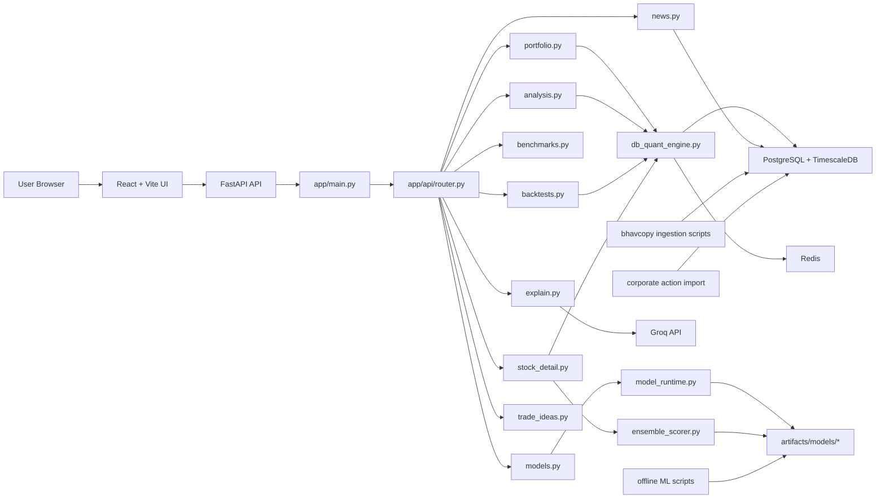

# NSE AI Portfolio Manager Architecture

## Objective

Describe the current merged snapshot checked out in this directory at `e9e88097f2dbc798a1dc97796dbd929c0c19e655`.

The architecture is a local-first NSE research demo with three hard requirements:

- the quant path works without any external API dependency
- model/artifact readiness is exposed explicitly to the UI
- Groq is confined to explanation/chat surfaces and never gates core portfolio math

## Topology



## Directory Map

The directory layout currently supports the architecture above:

```text
.
├── src/                         # Frontend app, tabs, shared UI services
├── apps/api/                    # FastAPI service, ML runtime, ingestion, models
├── data/raw/                    # NSE raw input archives
├── docs/                        # Architecture, plan, proof notes
├── infra/docker/                # Compose Dockerfiles
├── scripts/                     # Smoke tests and maintenance helpers
├── tmp/ui-smoke/                # Local validation screenshots and helper scripts
└── docker-compose.yml           # Local stack wiring
```

## Frontend Surface

The shell in `src/App.tsx` now exposes these first-class tabs:

- `Market`
- `Portfolio`
- `Trade Ideas`
- `Backtest`
- `Compare`

The persistent `AIChat` widget stays available regardless of the active tab.

### Portfolio workspace

`PortfolioWorkspace.tsx` has two views:

- `Build Portfolio` uses `GenerateTab.tsx`
- `Analyze Holdings` uses `AnalyzeTab.tsx`

This split reflects the current product design: generation and holdings analysis are related, but they are not the same workflow.

### Current tab responsibilities

- `MarketTab.tsx` presents market/regime context and navigational utility.
- `GenerateTab.tsx` handles mandate entry, runtime status, portfolio generation, and explanation hooks.
- `AnalyzeTab.tsx` handles pasted or manually assembled holdings and rebalancing guidance.
- `BacktestTab.tsx` handles historical replay with runtime awareness, taxes, and costs.
- `CompareTab.tsx` handles benchmark summaries and comparative charts.
- `AIChat.tsx` provides a floating assistant that passes current portfolio context to the backend.

## Backend Runtime

### Boot sequence

`app/main.py` now performs three important startup actions:

1. local bootstrap of DB/runtime state
2. local artifact readiness detection through `model_runtime.py`
3. scheduler startup attempt for auto-ingestion when the scheduler dependency is present

### Core orchestration

`db_quant_engine.py` remains the single orchestration layer for:

- portfolio generation
- holdings analysis
- backtesting
- expected-return routing
- constrained allocation
- fallback behavior when artifacts are missing

`ensemble_scorer.py` handles multi-model combination across:

- LightGBM
- LSTM
- GNN
- death-risk

`model_runtime.py` is the readiness authority for:

- component availability
- artifact versioning
- training mode reporting
- active mode classification
- Groq connectivity visibility

### Runtime modes

The backend now exposes runtime state honestly instead of implying one fixed model path:

- `full_ensemble` when required and optional components are available
- `degraded_ensemble` when the core path exists but some optional components are missing
- `rules_only` when the ML artifact path is not available

## API Contract

`app/api/router.py` registers the current route set:

- `GET /healthz`
- `GET /api/v1/models/current`
- `GET /api/v1/portfolio/...`
- `GET /api/v1/analysis/...`
- `GET /api/v1/backtests/...`
- `GET /api/v1/benchmarks/...`
- `GET /api/v1/market-data/...`
- `GET /api/v1/news/...`
- `GET /api/v1/explain/...`
- `GET /api/v1/stock/...`
- `GET /api/v1/trade-ideas/...`

### Model status endpoint

`GET /api/v1/models/current` is the single source of truth for runtime readiness. It drives the runtime banner in the frontend and informs whether generation/backtest should be labeled as rules-only, degraded, or fully ensemble-backed.

The response now carries the current mode, active components, missing components, model version, artifact classification, training mode, and Groq availability.

### Explanation boundary

Groq-backed text generation is confined to `groq_explainer.py` and the explain/chat routes.

Important boundary behavior:

- quant routes continue even when Groq is missing
- explanation routes degrade gracefully
- the UI shows the degraded state explicitly

## Data Architecture

### Persistence

PostgreSQL + TimescaleDB stores:

- instruments
- daily bars
- corporate actions
- portfolio runs
- backtest runs
- ingestion runs

Redis remains available for runtime support and future task/workflow coordination.

### Artifact storage

Artifacts live under `apps/api/artifacts/models/` and are consumed by the runtime on disk.

Current artifact families:

- `lightgbm_v1`
- `lstm_v1`
- `gnn_v1`
- `death_risk_v1`
- `ensemble_v1`

### Data flow

1. NSE bhavcopy ingestion loads raw history.
2. Corporate actions enrich and adjust historical replay data.
3. Training or materialization scripts populate local model artifacts.
4. `model_runtime.py` validates the artifact tree.
5. `db_quant_engine.py` and `ensemble_scorer.py` consume the artifacts at request time.

## Docker and Local Dev

`docker-compose.yml` wires the current local stack:

- `web` on port `3000`
- `api` on port `8000`
- `postgres` on port `5433`
- `redis` on port `6379`

The current API CORS policy includes the local dev origins used during browser testing, including `3000`, `3001`, `4173`, and `5173` on both `localhost` and `127.0.0.1`.

## UI Smoke Validation

The repository now also contains a UI smoke runner under `scripts/ui-smoke-playwright.mjs` and validation artifacts in `tmp/ui-smoke/`.

The smoke pass validates the same flows the app exposes in the browser:

- Generate
- Analyze
- Backtest
- Compare
- AI Chat

## Current Gaps

The architecture is stable for a local capstone demo, but a few areas remain intentionally non-final:

- official benchmark reconstruction is still proxy-based
- model quality depends on what artifacts are present locally
- the system is research-grade EOD analysis, not broker execution infrastructure
- broader automated regression coverage still needs to grow beyond the smoke pass
