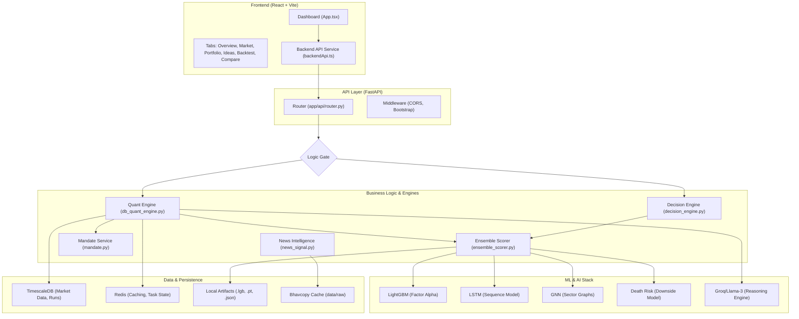

# NSE Atlas Architecture: System Design & Technical Specification
**Version:** 4.22.8-STABLE (kairavee-improv branch)
**Classification:** Research-Grade Institutional Portfolio Stack

## 1. Executive Objective
NSE Atlas is a local-first, AI-augmented research and intelligence platform for the Indian equity markets. The architecture is designed to transition raw market data (NSE Bhavcopy) into actionable institutional portfolios through a multi-model ensemble and a mandate-driven quantitative engine.

### Core Architectural Pillars
- **Local-First Computation**: Zero dependency on cloud-based ML inference or proprietary data APIs.
- **Ensemble Intelligence**: Hybrid signals from Gradient Boosting (LGBM), Recurrent Neural Networks (LSTM), and Graph Neural Networks (GNN).
- **Fiduciary Compliance**: Integrated Indian tax (Budget 2024) and SEBI fee schedules in all simulation loops.
- **Graceful Degradation**: Intelligent fallback to a rules-based engine when ML artifacts are missing.

---

## 2. System Topology
The system follows a modern decoupled architecture with a high-performance Python backend and a data-dense React frontend.

---

## 3. Data Architecture & Ingestion

### 3.1 Time-Series Pipeline (`app/ingestion/`)
- **NSE Bhavcopy**: Automated ingestion of `.zip` archives from NSE Archives. Uses idempotent upserts into the `daily_bars` table.
- **Corporate Actions**: Processes Splits, Bonuses, and Dividends to produce a **Backward-Adjusted Total Return Series**.
- **Market Regime**: Computes market breadth (% stocks above 200-SMA) to classify Bull/Bear/Neutral states.

### 3.2 Relational Schema (`app/models/`)
- **`Instrument`**: Master table for symbols, ISINs, and sector metadata.
- **`DailyBar`**: Primary OHLCV + Delivery % time-series.
- **`GeneratedPortfolioRun`**: Persists optimization results and allocation rationale.
- **`BacktestRun`**: Stores historical replay results, including equity curves and tax/fee breakdowns.

---

## 4. The Intelligence Stack

### 4.1 Ensemble Scorer (`ensemble_scorer.py`)
A heterogeneous ensemble that blends signals based on the **Market Regime**:
| Model | Technology | Target |
| :--- | :--- | :--- |
| **LightGBM** | Gradient Boosting | Cross-sectional factor alpha |
| **LSTM** | PyTorch (RNN) | Short-term sequential momentum |
| **GNN** | Torch Geometric | Sector-level structural correlation |
| **Death Risk** | Scikit-Learn | Downside bankruptcy/distress screen |

**Regime Weighting Strategy:**
- **Bull**: High LGBM (50%) and Momentum (35%).
- **Bear**: High GNN (60%) for structural resilience and 2.5x Death Risk penalty.
- **Neutral**: Balanced allocation with Quality factor bias.

### 4.2 Mandate Logic (`mandate.py`)
Translates user intent into quantitative constraints:
- **Horizon (2-24 weeks)**: Adjusts selection bias between Momentum (Short) and Quality (Long).
- **Risk Attitude**: Adjusts the **Risk Aversion Coefficient (λ)** in the optimizer and enforces strict volatility/death-risk caps.

---

## 5. The Quant Engine (`db_quant_engine.py`)

### 5.1 Optimization & Allocation
1. **Candidate Selection**: Filters universe by mandate constraints (Small Cap exclude, Sector limits).
2. **Scoring**: Injects Ensemble predictions into each security snapshot.
3. **Portfolio Construction**: Uses a constrained mean-variance optimizer proxy to build the target basket.
4. **Share Sizing**: Implements a **Greedy Whole-Share Allocation** algorithm that distributes residual cash based on weight priority.

### 5.2 Backtest Replay
Simulates historical performance with institutional fidelity:
- **Fees**: NSE Transaction Charges + SEBI Fees + GST + STT.
- **Taxes**: FIFO lot accounting for STCG (20%) and LTCG (12.5% > ₹1.25L).
- **Corporate Actions**: Dividends are reinvested on the ex-date; price series are adjusted for splits.

---

## 6. Frontend Surface (`src/`)

### 6.1 Dashboard Components
- **Overview**: System health, ML robustness KPIs, and Market Regime pulse.
- **Market**: Sector heatmaps and factor "weather" (Momentum, Quality, Value).
- **Portfolio**: Mandate questionnaire and live recommended basket with AI rationales.
- **Backtest**: Historical replay interface with equity curve visualization.
- **Compare**: Multi-strategy benchmarking (AI vs Nifty 50 vs Factor Proxies).

### 6.2 State Management
- **Local-First**: UI falls back to `portfolioService.ts` local logic if the backend is unreachable.
- **React 19**: Leverages modern hooks for asynchronous data fetching and responsive state updates.

---

## 7. Infrastructure & Deployment
- **Docker Orchestration**: 4-service stack (Web, API, Postgres/Timescale, Redis).
- **Artifact Management**: Versioned discovery for ML models (e.g., `lightgbm_v2/`).
- **Observability**: `observability.py` tracks latency p95, error rates, and ML fallback frequency.

---
**Documentation Note:** This architecture is periodically validated via the `phase:acceptance` suite. Any changes to the core `Snapshot` dataclass in the Quant Engine must be mirrored in the Pydantic schemas.
