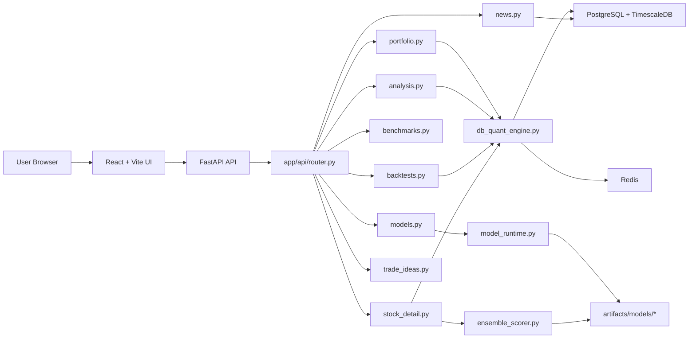

# NSE Atlas Architecture

## Objective

NSE Atlas is a local-first research stack for Indian equities. The live architecture currently optimizes for:

- explicit model-runtime visibility
- backend-first portfolio generation and holdings analysis
- local artifact usage for ensemble inference
- graceful degradation when infrastructure is unavailable

## Topology

## Frontend Surface

The shell in `src/App.tsx` exposes:

- `Overview`
- `Market`
- `Portfolio`
- `Trade Ideas`
- `Backtest`
- `Compare`

`PortfolioWorkspace.tsx` contains two focused workflows:

- `Build Portfolio`
- `Analyze Holdings`

Removed from the active frontend surface:

- AI chat widget
- events tab
- rebalance portfolio tab
- generate AI analysis panel

## Backend Runtime

`db_quant_engine.py` remains the main orchestration layer for:

- portfolio generation
- holdings analysis
- backtesting
- allocation constraints
- ensemble fallback handling

Recent runtime behavior now makes the separation explicit:

- mandate horizon drives portfolio decision logic
- model history requirements drive feature availability
- ensemble scoring can request deeper history than the portfolio horizon

## Diversification Controls

Portfolio generation now applies diversification at two stages:

1. candidate selection prefers a more sector-spread final basket
2. weight projection caps concentration at both name and sector level

This prevents the portfolio generator from simply taking the top-scoring names from one cluster and calling it diversified.

## Runtime Modes

The backend reports one of these states:

- `full_ensemble`
- `degraded_ensemble`
- `rules_only`

The UI reads that status before generation or analysis workflows decide how to behave.

## Active Route Surface

`app/api/router.py` registers the current route families:

- model status
- portfolio generation
- holdings analysis
- backtests
- benchmarks
- market data
- news
- stock detail
- trade ideas

Removed route family:

- explain/chat

## Data Architecture

Primary persistence:

- PostgreSQL + TimescaleDB for instruments, bars, runs, and related state
- Redis for runtime support

Artifact storage:

- `apps/api/artifacts/models/lightgbm_v1/`
- `apps/api/artifacts/models/lstm_v1/`
- `apps/api/artifacts/models/gnn_v1/`
- `apps/api/artifacts/models/death_risk_v1/`
- `apps/api/artifacts/models/ensemble_v1/`

## Validation Surface

Current validation focuses on:

- frontend production build
- backend syntax/import checks
- local smoke coverage for generate, analyze, backtest, and compare

Live end-to-end backend flows still depend on PostgreSQL being reachable.
